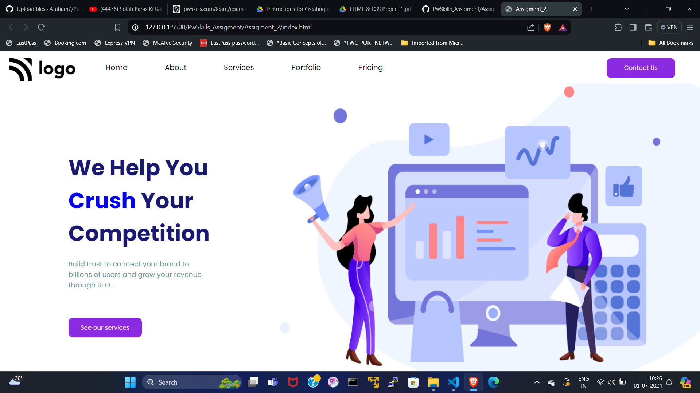

# This is Assigment_2 result :


# Html Code :
```HTML

<!DOCTYPE html>
<html lang="en">
<head>
    <meta charset="UTF-8">
    <meta name="viewport" content="width=device-width, initial-scale=1.0">
    <title>Assigment_2</title>
    <link rel="stylesheet" href="style.css">

    <link rel="preconnect" href="https://fonts.googleapis.com">
    <link rel="preconnect" href="https://fonts.gstatic.com" crossorigin>
    <link href="https://fonts.googleapis.com/css2?family=Poppins:ital,wght@0,100;0,200;0,300;0,400;0,500;0,600;0,700;0,800;0,900;1,100;1,200;1,300;1,400;1,500;1,600;1,700;1,800;1,900&display=swap" rel="stylesheet">
</head>
<body>
    <div class="container">
        <!-- Nav_bar -->
        <nav class="nav_bar">
            <div class="logo">
                
            </div>

            <div class="main_nav_bar">
                <ul>
                    <li>Home</li>
                    <li>About</li>
                    <li>Services</li>
                    <li>Portfolio</li>
                    <li>Pricing</li>
                </ul>
            </div>

            <div class="contacts">
                <button class="contact_btn">Contact Us</button>
            </div>

        </nav>


        <!-- main -->
        <main class="main">
            <!-- section -->
            <section class="left_side">
                <div class="main_heading">
                    <h1>
                        <span class="dark_txt">We help you</span>
                        <span class="blue-txt">Crush</span>
                        <span class="dark_txt">Your Competition</span>
                    </h1>
                </div>
                <p> Build trust to connect your brand to billions of users and grow your revenue through SEO. </p>
                <div class="btn">
                    <button class="services">See our services</button>
                </div>
            </section>
        
            <!-- aside -->
            <aside class="right_side">
                <!-- <div class="right_side_img">
                </div> -->
            </aside>
        </main>


        
    </div>
    
</body>
</html>

```


# Css Code :
```CSS

*{
    margin: 0px;
    padding: 0px;
    box-sizing: border-box;

    font-family: "Poppins", sans-serif;
}

.container{
    box-sizing: border-box;

    width: 100%;
    height: 100%;
}


.nav_bar{
    padding-top: 20px;
    padding: 15px 20px 0px 20px ;

    width: 100vw;
    height: 10vh;
    display: flex;
    
}

.main_nav_bar ul{
    margin-left: 25px;
    display: flex;
    justify-content: flex-start;
}
.contact_btn{
    
    width: 150px;
    margin-left: 300% ;
}

ul li{
    list-style: none;
    padding: 8px 16px;
    margin: 0px 25px;
}

.main{
    display: flex;
    flex-direction: row;
}

.left_side{
    height: 90vh;
    width: 40vw;
    padding: 150px;
}

.right_side{
    display: block;
    width: 60vw;

    background-image: url("./images/aside.png");
    background-size: cover;
    background-position: center;
}

div button{
    border: 2px solid transparent;
    border-radius: 10px;
    padding: 10px 25px;
    background-color: blueviolet;
    color: antiquewhite;
}

.main_heading{
    width: 21vw;
    font-size: 200%;
}

h1{
    text-transform: capitalize ;
}

.left_side p{
    margin-top: 20px;
    color: cadetblue;
    font-size: 15px;
}

.btn{
    margin-top: 60px;
}
.main_heading .blue-txt{
    color: blue;
}

.main_heading .dark_txt{
    color: midnightblue;
}

```
