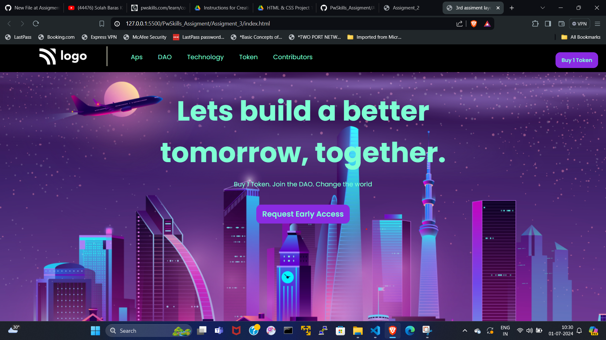

# This is Assigment_2 result :


# Html Code :
```HTML

<!DOCTYPE html>
<html lang="en">
<head>
    <meta charset="UTF-8">
    <meta name="viewport" content="width=device-width, initial-scale=1.0">
    <title>3rd assiment layout design</title>

    <link rel="stylesheet" href="./style.css">

    <!-- adding font link -->
    <link rel="preconnect" href="https://fonts.googleapis.com">
    <link rel="preconnect" href="https://fonts.gstatic.com" crossorigin>
    <link href="https://fonts.googleapis.com/css2?family=Poppins:ital,wght@0,100;0,200;0,300;0,400;0,500;0,600;0,700;0,800;0,900;1,100;1,200;1,300;1,400;1,500;1,600;1,700;1,800;1,900&display=swap" rel="stylesheet">

</head>
<body>
    <div class="container">
        <header class="header">
            <div class="logo">
                
            </div>
            <span class="horizontal_saperator"></span>
            <ul class="nav_link">
                <li>Aps</li>
                <li>DAO</li>
                <li>Technology</li>
                <li>Token</li>
                <li>Contributors</li>
            </ul>

            <div class="buy_token">
                <button class="token_btn">
                    Buy 1 Token
                </button>
            </div>
        </header>
        <main class="main_body">
            <din class="body_container">
                <h1>
                    Lets build a better tomorrow, together.
                </h1>
                <p>
                    Buy 1 Token. Join the DAO. Change the world
                </p>
                <button class="request_btn">Request Early Access</button>
            </din>
        </main>
    </div>
</body>
</html>
```


# Css Code :
```CSS

*{
    margin: 0px;
    padding: 0px;

    color: aquamarine;
    font-family: "Poppins", sans-serif;
    font-style: normal;
}

button{
    background-color: blueviolet;
    padding: 10px;
    border: none;
    border-radius: 12px;
    padding: 10px 15px;

    font-weight: 600;
}

.container{
    display: flex;
    flex-direction: column;

    justify-content: flex-start;
}

.header{
    background-color: rgb(0, 0, 0);
    display: flex;
    flex-direction: row;

    width: 100vw;
    height: 20%;
}
.logo{
    /* border: 2px solid brown; */
    width: 120px;
    height: 40px;
    margin: 10px 0px 20px 100px ;


}
.horizontal_saperator{
    display: inline-block;

    width: 2px;
    height: 50px;

    background-color: beige;

    margin: 5px 0px 5px 50px ;

}
.nav_link{

    list-style: none;
    margin: 20px 0px 20px 40px;
    width: 500px;
    display: flex;

    justify-content: space-around;
}

.token_btn{
    position: absolute;
    right: 20px;
    top: 20px;
}

.main_body{

    display: flex;
    height: 90vh;
    
    background-image: url("./images/bcg.png");
    background-size: cover;
    background-position: center;

    justify-content: center;
}

.body_container {
    width: 755px;
    height: 380px;
    border: 2px solid transparent;

    margin-top: 45px;
    text-align: center;
}

.body_container h1{
    font-weight: 700;
    font-size: 70px;
}

.body_container p{
    margin-top: 15px;
}

.body_container .request_btn{
    margin-top: 40px ;
    
    font-size: larger;
}
```
