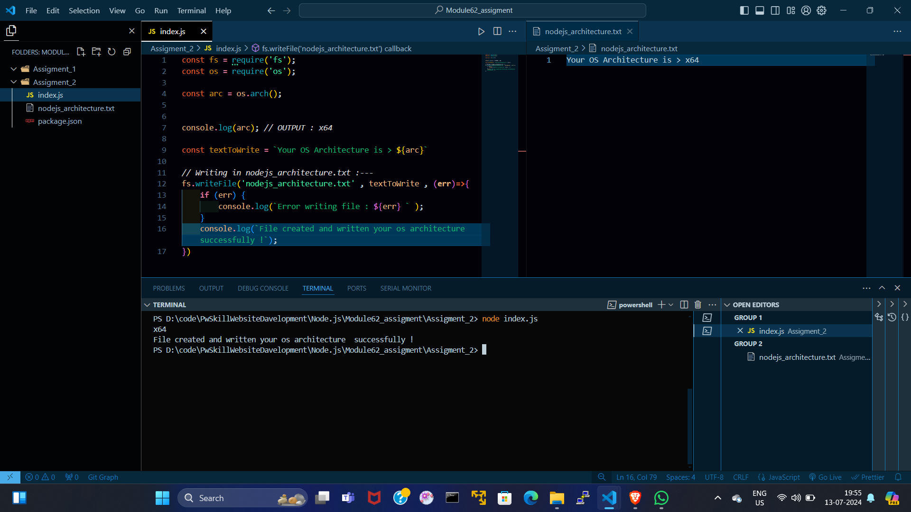

# index.js :---
```index.js
const fs = require('fs');
const os = require('os');

const arc = os.arch();

console.log(arc); // OUTPUT: x64

const textToWrite = `Your OS Architecture is > ${arc}`;

// Writing in nodejs_architecture.txt
fs.writeFile('nodejs_architecture.txt', textToWrite, (err) => {
    if (err) {
        console.log(`Error writing file: ${err}`);
    } else {
        console.log('File created and written your OS architecture successfully!');
    }
});
```

# nodejs_architecture.txt :---
```nodejs_architecture.txt
  Your OS Architecture is > x64
```


# OUTPUT :---

