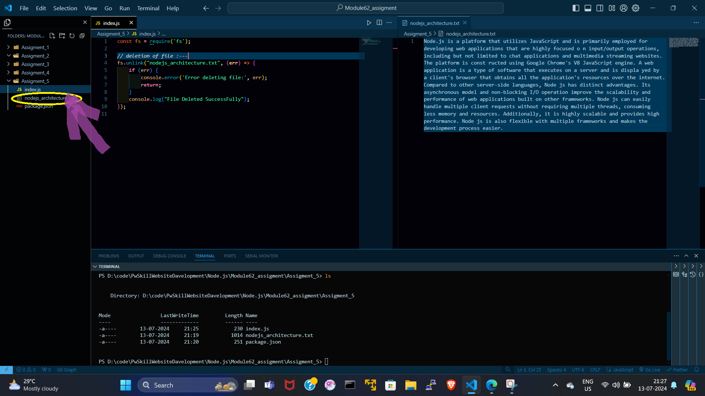
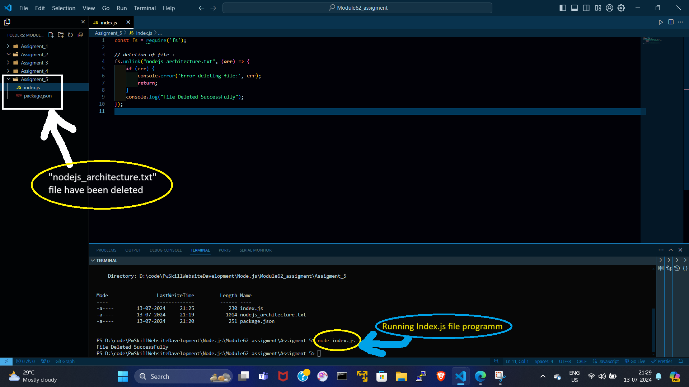

# index.js :---
```index.js
const fs = require('fs');

// deletion of file :---
fs.unlink("nodejs_architecture.txt", (err) => {
    if (err) {
        console.error('Error deleting file:', err);
        return;
    }
    console.log("File Deleted SuccessFully");
});


// Sir/ma'am please run index.js file and delete the "nodejs_architecture.txt" file .

```


# Before_modification(before running the code) :---


# After_modification(after running the code) :---

