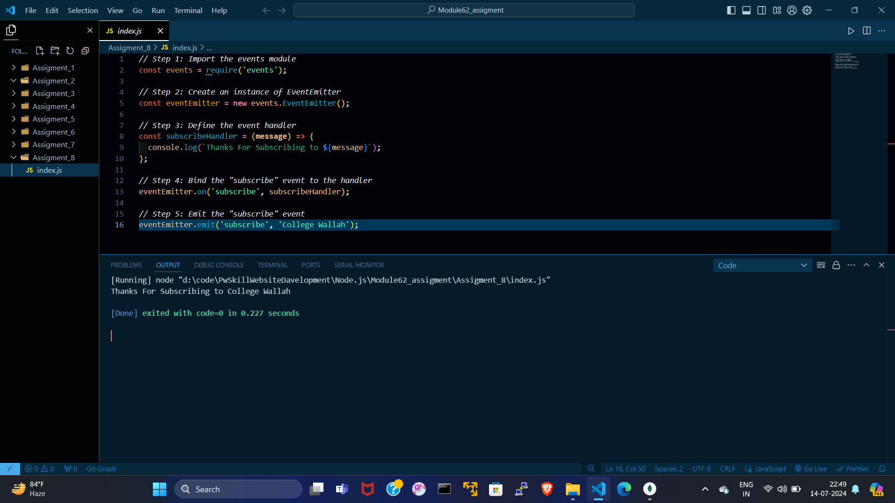

# index.js :---
```index.html
// Step 1: Import the events module
const events = require('events');

// Step 2: Create an instance of EventEmitter
const eventEmitter = new events.EventEmitter();

// Step 3: Define the event handler
const subscribeHandler = (message) => {
  console.log(`Thanks For Subscribing to ${message}`);
};

// Step 4: Bind the "subscribe" event to the handler
eventEmitter.on('subscribe', subscribeHandler);

// Step 5: Emit the "subscribe" event
eventEmitter.emit('subscribe', 'College Wallah');
```

# OUTPUT :---

