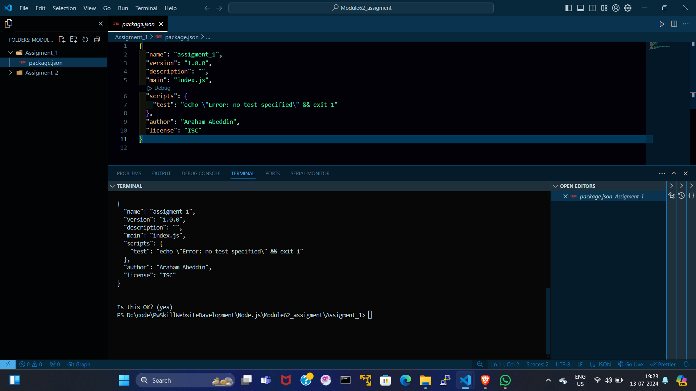

# package.json :---
```
  {
  "name": "assigment_1",
  "version": "1.0.0",
  "description": "",
  "main": "index.js",
  "scripts": {
    "test": "echo \"Error: no test specified\" && exit 1"
  },
  "author": "Araham Abeddin",
  "license": "ISC"
}
```

# OUTPUT :---

