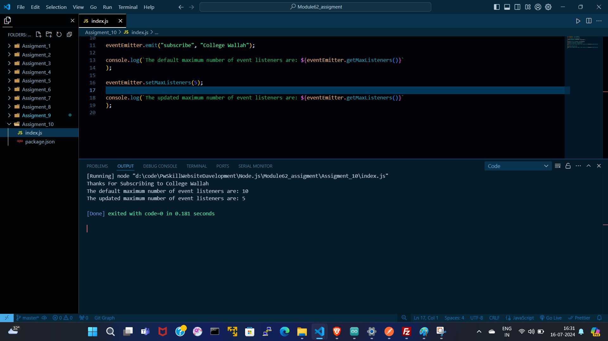

# index.js :---
```inde.js
  const EventEmitter = require("events");

const eventEmitter = new EventEmitter();

const subscribeMessage = (channelName) => {
  console.log(`Thanks For Subscribing to ${channelName}`);
};

eventEmitter.addListener("subscribe", subscribeMessage);

eventEmitter.emit("subscribe", "College Wallah");

console.log(`The default maximum number of event listeners are: ${eventEmitter.getMaxListeners()}`
);

eventEmitter.setMaxListeners(5);

console.log(`The updated maximum number of event listeners are: ${eventEmitter.getMaxListeners()}`
);

```

# OUTPUT :---

