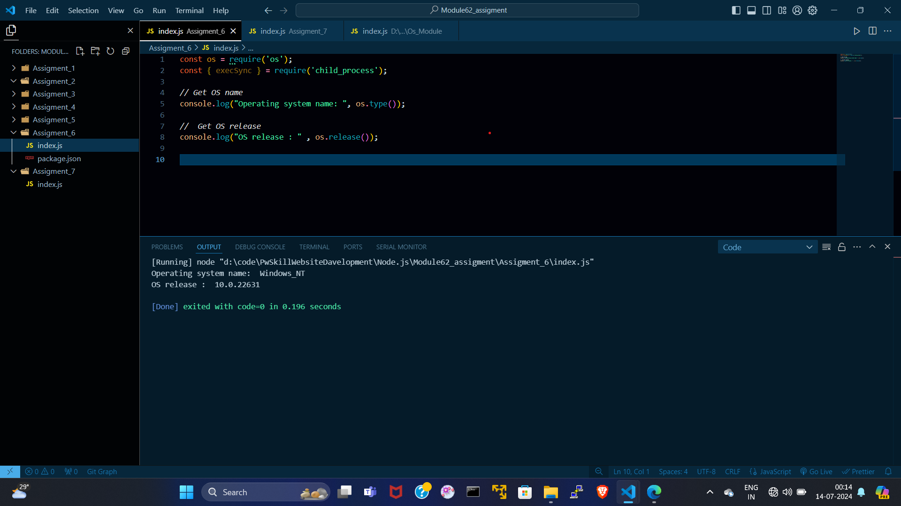

# index.js :---
```index.js
const os = require('os');
const { execSync } = require('child_process');

// Get OS name
console.log("Operating system name: ", os.type());

//  Get OS release 
console.log("OS release : " , os.release());

```


# OUTPUT :---

