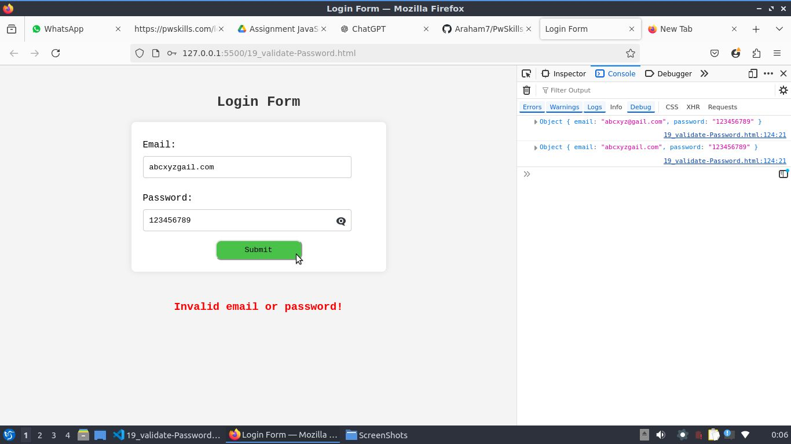

# (Q.1). Password Validator:

## Write a JavaScript program that checks if the entered password matches the confirmed password. If the passwords match, the program should log "Password Matched. Password validation Successful." to the console.Otherwise, it should log "Password didn't match. Password validation unsuccessful" to the console.

### Sol.
```Javascript
function passwordValidator(password , confirmPassword) {
    if (password === confirmPassword) {
        console.log(`Password Matched. Password validation Successful.`);
    } else {
        console.log(`Password didn't match. Password validation unsuccessful.`);
    }
}

/*
// Uncomment this code to get input from the user :---
const password = prompt("Enter the password!");
const confirmPassword = prompt("Enter the confirmPassword!");
*/

const password1 = "00001111";
const confirmPassword1 = "00001111";

passwordValidator(password1 , confirmPassword1); // OUTPUT: Password Matched. Password validation Successful.


const password2 = "12345";
const confirmPassword2 = "12348";
passwordValidator(password2 , confirmPassword2); // OUTPUT: Password didn't match. Password validation unsuccessful.
```

### Output:
```Output:
Password Matched. Password validation Successful.
Password didn't match. Password validation unsuccessful.
```

<hr>

# (Q.2). Calculator:

## Create a javascript program that takes in two numbers and a string operator. Make use of a switch statement to perform the operation on the two numbers.The calculator function should"
- Take in two numbers, num1 and num2, and a string representing a mathematical operator, operator
- Use a switch statement to determine which operation to perform based on the value of the operator
- If the operator is one of the four valid operators (+, -, *, /), perform the corresponding mathematical operation and store the result in a variable called result
- If the operator is not one of the valid operators, log "Invalid operator" to the console.


### Sol.
```Javascript
function calculator(num1, num2, arithmaticOperator) {
    switch (arithmaticOperator) {
        case '+':
            console.log(num1 + num2);
            break;

        case '-':
            console.log(num1 - num2);
            break;

        case '*':
            console.log(num1 * num2);
            break;

        case '/':
            console.log(num1 / num2);
            break;

        default:
            console.log('Invalid operator');
            break;
    }
}

calculator(5, 6, "+"); // Addition
calculator(658, 35, "-"); // Subtraction
calculator(5, 6, "*"); // Multiplication
calculator(108, 6, "/"); // Division

calculator(562, 58, '!'); // Invalid operator
```

### Output:
```Output:
11
623
30
18
Invalid operator
```

<hr>

# (Q.3). Color Mixer:

# Write a JavaScript program that takes in two strings representing colors and uses a `switch` statement to determine the resulting color when the two colors are mixed. The program should print the resulting color based on the following criteria:

- If `color1` is "red" and `color2` is "blue" (or vice versa), print "purple".
- If `color1` is "red" and `color2` is "yellow" (or vice versa), print "orange".
- If `color1` is "blue" and `color2` is "yellow" (or vice versa), print "green".
- If any other combination of colors is input, the program should print "Invalid color combination".


### Sol.
```Javascript
// Long method :---

function resultColor(color1 , color2) {
    switch (color1) {
        case "red":
            switch (color2) {
                case "blue":
                    console.log("purple");
                    break;
                case "yellow":
                    console.log("orange");
                    break;
                default:
                    console.log("Invalid color combination");
                    break;
            }
            break;

        case "blue":
            switch (color2) {
                case "red":
                    console.log("purple");
                    break;
                case "yellow":
                    console.log("green");
                    break;
                default:
                    console.log("Invalid color combination");
                    break;
            }
            break;

        case "yellow":
            switch (color2) {
                case "blue":
                    console.log("green");
                    break;
                case "red":
                    console.log("orange");
                    break;
                default:
                    console.log("Invalid color combination");
                    break;
            }
            break;
        default:
            console.log("Invalid color combination");
            break;
    }
}


resultColor("red", "blue");    // Output: purple
resultColor("yellow", "blue");  // Output: green
resultColor("red", "yellow");  // Output: orange
resultColor("red", "green");    // Output: Invalid color combination


console.log("****************************************************");

// Short method :---
function colorMixer(color1 , color2) {
    switch (`${color1}-${color2}`) {
        case "red-blue":
        case "blue-red":
            console.log("purple");
            break;
        
        case "red-yellow":
        case "yellow-red":
            console.log("orange");
            break;
        case "blue-yellow":
        case "yellow-blue":
            console.log("green");
            break;
        default:
            console.log("Invalid color combination");
            break;
    }
}

colorMixer("red", "blue");    // Output: purple
colorMixer("yellow", "blue");  // Output: green
colorMixer("red", "yellow");  // Output: orange
colorMixer("red", "green");    // Output: Invalid color combination
```

### Output:
```Output
purple
green
orange
Invalid color combination
****************************************************
purple
green
orange
Invalid color combination
```

<hr>

# (Q.4). Highest Marks:

## A teacher wants to find out the highest marks scored by a student in a class of five students. The teacher enters the marks of all five students in an array called "marks". Write a program that iterates through the array and finds the highest marks scored by any student in the class. The highest marks must then be displayed to the teacher using the console. Make sure you use the ternary operator to find the student with the highest marks.

### Sol.
```Javascript
let marks = [85, 92, 78, 90, 88];
let highestMarks = marks[0];

for (let i = 0; i < marks.length ; i++) {
    highestMarks = ((marks[i]>highestMarks) ? marks[i] : highestMarks);
}

console.log(highestMarks);
```
### Output:
```Output
92
```

<hr>

# (Q.5). Capitalize:

## You are building a form where users can enter their names. You want to make sure that the first letter of the name is always capitalized, even if the user forgets to do so. Write a program that takes in the user's name as a string and uses the ternary operator to check if the first letter is lowercase. If it is, the program capitalizes it and returns the modified string. Otherwise, it returns the original string without any changes.

### Sol. 
```Javascript
/*
// Uncomment this multyline of code to get "userName" by the user.
let userName = prompt("Enter userName > ");
*/
let userName = "ArahamAbeddin"

// Check if the first letter is uppercase and the rest are lowercase
let isProperlyFormatted = userName[0].toUpperCase() === userName[0] && userName.slice(1) === userName.slice(1).toLowerCase();

// Capitalize the first letter and make the rest lowercase
let formattedUserName = userName[0].toUpperCase() + userName.slice(1).toLowerCase();

// If not properly formatted, update the userName
userName = isProperlyFormatted ? userName : formattedUserName;

console.log(userName);
```

### Output:
```Output
Arahamabeddin
```

<hr>

# (Q.6). Vowel Counter:

## We want to count the number of vowels in a person's name. Given a name as input, the program should iterate through each character in the name, and check if it is a vowel or not. If the character is a vowel, it should be counted.

### Sol.

```Javascript
function vowelCounter(name) {
let vowel = "aeiouAEIOU";
let count = 0;

for (let i = 0; i < name.length; i++) {
    if (vowel.includes(name[i])) {
        count++
    }
}
// console.log(count);
return count;
}

let userName = "ArahamAbeddin";

let numberOfVowel = vowelCounter(userName);

console.log(`Number of vowel in the userName = ${numberOfVowel}`);
```

### Output:
```Output
Number of vowel in the userName = 6
```

<hr>

# (Q.7). Remove Duplicates:

## In an online shopping application, customers can add multiple items to their cart. However, sometimes customers accidentally add the same item more than once, resulting in duplicate items in their cart. The duplicate items not only make it difficult for the customer to track the items they want to purchase but also affect the accuracy of the purchase order. To solve this problem, the application needs to remove duplicate items from the customer's cart. The programshould take the customer's cart with duplicates as input, and return a new cart without duplicates. Write a program to solve the problem of duplicate items in the cart by removing duplicates.

### Sol.
```Javascript
let cart = ["mango", "orange", "apple", "mango", "banana", "apple", "mango", "guava"];

function removeDuplicateItems(cartItems) {
    let uniqueCart = [...new Set(cartItems)];
    // console.log(uniqueCart);
    return uniqueCart;
}

let uniqueItemCart = removeDuplicateItems(cart);

console.log(uniqueItemCart);
```

### Output:
```Output
[ 'mango', 'orange', 'apple', 'banana', 'guava' ]
```

<hr>

# (Q.8). Inverted right-angled triangle pattern with asterisks:

## Write a program that takes an integer input i and prints an inverted right-angled triangle pattern of asteriskswith i rows.
- Inverted right-angled pattern:
```
*****
*****
****
***
**
*
```
If i=6

### Sol. 
```Javascript
let num = 6;
function generatePattern(i) {
    for (i; i > 0; i--) {
        console.log("*".repeat(i));
    }
}

generatePattern(num);
```

### Output:
```Output
******
*****
****
***
**
*
```

<hr>

# (Q.9). Check for divisibility:

## Write a program that takes an array of numbers and prints all the numbers that are divisible by 3, but not by 2.Use a for loop and continue statement .

### Sol.
```Javascript
let arr = [3, 6, 9, 12, 15, 22, 25, 27, 30, 45, 53, 67, 70, 89 ];

for (let i = 0; i < arr.length; i++) {
    const num = arr[i];
    if (num % 3 === 0 && num % 2 !== 0) {
        console.log(`number ${num} is divisible by 3 but not by 2.`);
    }
}
```

### Output:
```Output
number 3 is divisible by 3 but not by 2.
number 9 is divisible by 3 but not by 2.
number 15 is divisible by 3 but not by 2.
number 27 is divisible by 3 but not by 2.
number 45 is divisible by 3 but not by 2.
```

<hr>

# (Q.10). Correct a bug:

## You are working on an e-commerce website where customers can add items to their cart. The cart stores the quantity of each item that the customer wants to purchase in an array of numbers. However, the website is currently experiencing a bug where the quantity of each item is being recorded incorrectly by reducing it to half. As a result, you need to write a JavaScript function that can double the quantity of each item in the cart array to correct the bug.

### Sol.
```Javascript
function doubleCartQuantities(cart) {
    for (let i = 0; i < cart.length; i++) {
        cart[i] *= 2; // Double the quantity of each item
    }
    return cart; // Return the updated cart
}

// Example usage:
const cartQuantities = [3, 6, 9, 12, 15, 22, 25, 27, 30, 45, 53, 67, 70, 89 ]; // Original quantities
const correctedCart = doubleCartQuantities(cartQuantities);

console.log(correctedCart); 
// Output:[ 6,  12, 18, 24,  30,  44, 50,  54, 60, 90, 106, 134, 140, 178 ]
```

### Output:
```Output
[
    6,  12, 18, 24,  30,  44,
   50,  54, 60, 90, 106, 134,
  140, 178
]
```

<hr>

# (Q.11). Unit converter:

## A local weather station needs to convert temperature data collected in Celsius to Fahrenheit before displaying it on its website. They want a function that can convert Celsius to Fahrenheit accurately and efficiently. The function should take input in Celsius and return output in Fahrenheit. This function will help the weather station to provide temperature readings that are easily understandable to a wider audience.

### Sol.
```Javascript
function celsiusToFahrenheit(c) {
    let tempF = ((9 / 5)*c + 32);
    return tempF;
}

let tempC = 50;

let fahrenheitTemperature = celsiusToFahrenheit(tempC);
console.log(fahrenheitTemperature);
```

### Output:
```Output
122
```

<hr>

# (Q.12). A car rental company needs to calculate the cost of a rental based on the number of days rented and the type of car. They require a function that takes in the number of days rented and car type and returns the rental cost. The total cost would be the rental cost multiplied by the number of days rented. 
### The rental costs are:
- Economy = Rs. 4,000/- per day.
- Midsize = Rs. 10,000/- per day.
- Luxury = Rs. 20,000/- per day.

### Sol.
```Javascript
function calculateRentalCost(carType , day) {
    switch (carType) {
        case "Economy":
            console.log();
            return 4000*day;
            break;

            case "Midsize":
            return 10000*day;
            break;

            case "Luxury":
            return 20000*day;
            break;

        default:
            return "You selected wrong cartype";
            break;
    }
}

// Example usage :---
let totalCost = calculateRentalCost("Economy" , 55);

console.log(totalCost); // OUTPUT : 220000
```

### Output:
```Output
220000
```

<hr>

# (Q.13). Bill splitter:

## A restaurant wants to calculate the total bill for a table based on the cost of each dish and the number of people sharing it. They require a function that takes in the cost of each dish and the number of people sharing it and returns an object that contains the total bill and the bill to be paid by each person in the group.

### Sol.
```Javascript
function billSplitter(dishes, numberOfPerson) {
    let totalBill = 0;

    // Using a for loop to calculate total bill
    for (let i = 0; i < dishes.length; i++) {
        totalBill += dishes[i];
    }

    let billPerPerson = numberOfPerson >0 ? (totalBill / numberOfPerson) : 0;

    return {
        totalBill: totalBill,
        billPerPerson: billPerPerson
    };
}

// Sample input
const dishes = [55, 68, 89, 108, 507, 312, 512, 782, 659];

let result = billSplitter(dishes, 5);

console.log(result);
```

### Output:
```Output
{ totalBill: 3092, billPerPerson: 618.4 }
```

<hr>

# (Q.14). Calculate the final order price:

## A retail store needs to calculate the total cost of items in a customer's cart. A customer cart is an array of objects with unit price and quantity. Implement an arrow function to calculate the total cost of items, based on the unit price and quantity of each item.


### Sol.
```Javascript
const customerCart = [
  { unitPrice: 50, quantity: 2 },
  { unitPrice: 100, quantity: 1 },
  { unitPrice: 25, quantity: 4 }
];

function calateTotalPrice(cart) {
    let totalPrice = 0 ;
    for (let i = 0; i < cart.length; i++) {
      // totalPrice += ((cart[i]["unitPrice"])*(cart[i]["quantity"]));
        totalPrice += ((cart[i].unitPrice)*(cart[i].quantity));
      }
      return totalPrice;
}

let totalPrice = calateTotalPrice(customerCart);
console.log(totalPrice);
```

### Output:
```Output
300
```

<hr>

# (Q.15). Calculate the percentage of the discount:

## A retail store is offering a discount on its products and wants to calculate the percentage of the discount to show customers how much they can save. Given the original price and the discounted price of a product, implement an arrow function to calculate the percentage of the discount rounded off to two decimal places.This function could be useful for the store's marketing team to create promotions and offers that attract customers.

### Sol.
```Javascript
let CalculatorDiscountAmountAndPercent = (origionalPrice , discountedPrice)=>{
    let discountAmount = (origionalPrice - discountedPrice);
    let percentDiscount = ((discountAmount/origionalPrice)*100).toFixed(2);

    return {
        discountAmount: discountAmount ,
        percentDiscount: `${percentDiscount} %`
    }
}

let result = CalculatorDiscountAmountAndPercent(196 , 135);
console.log(result);
```

### Output:
```Output
{ discountAmount: 61, percentDiscount: '31.12 %' }
```

<hr>

# (Q.16). Generate a random number:

## Create a JavaScript program that generates a random number between 1 and 100 when the program starts.Use a self-invoking arrow function to generate the random number. This program can be used as a component in various games or applications that require a random number generator.

## Sol.
```Javascript
(()=>{
    let randomeNumber = Math.floor(Math.random()*100) + 1;
    console.log("Random Number:", randomeNumber);
})()
```

## Output:
```Output
Random Number: 8
```

<hr>

# (Q.17). Build a banking application:

## A banking application needs to manage customer accounts and transactions. The user detail is stored in an object with a keys name and balance. Write functions using object methods to update a customer's account balance based on a deposit or withdrawal.

### Sol.
```Javascript
customer = {
    name: "araham",
    balance: 0,

    deposit(b) {
        if (this.balance >= 0) {
            this.balance += b;
        }else{
            console.log(`Invalid deposit Amount!`);
        }
    },
    witdraw(w) {
        if (this.balance >= w) {
            this.balance -= w;
        } else {
            console.log(`You don't have sufficient balance to withdrow!`);
        }
    },
    checkBalance(){
        console.log(`Your current balance is : ${this.balance}`);
    }

}

customer.checkBalance(); // Your current balance is : 0

customer.deposit(150000);
customer.checkBalance(); // Your current balance is : 150000

customer.witdraw(120000);
customer.checkBalance(); // Your current balance is : 30000
```

# Output:
```Output
Your current balance is : 0
Your current balance is : 150000
Your current balance is : 30000
```

<hr>

# (Q.18). Change Text on Button click:

## Create a simple HTML page with a heading and a button. The initial text must be “The most affordable learning platform”, use JavaScript to change the heading text to “PW Skills” when the button is clicked. The button must toggle the text of a heading between "The most affordable learning platform" and "PW Skills" on each click.

### Sol.
```html
<!DOCTYPE html>
<html lang="en">
<head>
    <meta charset="UTF-8">
    <meta name="viewport" content="width=device-width, initial-scale=1.0">
    <title>Toggle Text</title>

    <style>
        body{
            background-color: burlywood;
        }

        #head-container{
            height: 100vh;
            display: flex;
            flex-direction: column;
            justify-content: center;
            align-items: center;
        }

        button{
            width: 300px;
            height: 10vh;
            border: 2px solid #000000;
            border-radius: 18px;
            font-weight: 550;
            font-size: 20px;
            cursor: pointer;
            background-color: #a88dc1;
        }
    </style>

</head>
<body>
    <div id="head-container">
            <h1>
                The most affordable learning platform
            </h1>
            <hr>
            <button>
                Click me to change above text!
            </button>
    </div>
        <script>
            let toggle = 0;
            const btn = document.querySelector("button");
            headingTxt = document.querySelector("h1");
            btn.addEventListener("click", ()=>{
                toggle = (toggle === 0) ? 1 : 0;
                console.log(toggle);
                if (toggle === 1) {
                    headingTxt.innerHTML = "PW Skills";
                } else {
                    headingTxt.innerHTML = "The most affordable learning platform";
                }
            })
        </script>
</body>
</html>
```

### Output:
<!-- ```Output: -->
### (i). clicking-1st-time-btn:


### (ii). clicking-2nd-time-btn:


### (iii). clicking-3rd-time-btn: 


> NOTE :
> as many time as you click the button the above text would gets toggal.

<hr>

# (Q.19). Validate Password

## You are building a login form for a website and need to validate user input using JavaScript. The form has two input fields: email and password, and a submit button.Your task is to implement JavaScript code that validates the email and password input fields. The email field should contain the "@" symbol. The password field should have a minimum length of 8 characters. If either of these conditions is not met, an error message “Invalid email or password!” should be displayed in red color as a paragraph text below the form. If the password is valid the message “Valid email and password!” must be displayed in green color as a paragraph text below the form.Your code should run when the user clicks the submit button and should prevent the form from submitting if the input is invalid. The input type of email must be text and the input type of password must be password without any minLength attribute specified.

### Sol.
```html
<!DOCTYPE html>
<html lang="en">
<head>
    <meta charset="UTF-8">
    <meta name="viewport" content="width=device-width, initial-scale=1.0">
    <title>Login Form</title>

    <style>
        *{
            font-family: 'Courier New', Courier, monospace;
        }
        body{
            margin: 0px;
            padding: 0px;

            background-color: #f4f4f4;
        }

        form{
            max-width: 400px;
            margin: auto;

            padding: 20px;
            background-color: #fff;
            border-radius: 8px;
            box-shadow: 0 0 10px rgba(0, 0, 0, 0.1);
        }

        h2{
            text-align: center;
            color: #333;
            margin-top: 50px;
        }

        h3{
            text-align: center;
            color: #ff0000;
            margin-top: 50px;
        }

        #submit-btn{
            text-align: center;
        }

        label {
            display: block;
            margin: 10px 0 5px;
        }

        input[type="text"] , input[type="password"]{
            width: calc(100% - 40px);
            padding: 10px;
            margin: 5px 0 15px;
            border: 1px solid #ccc;
            border-radius: 4px;
            box-sizing: border-box;
            background-color: #ffffff;
        }

        input[type="submit"]{
            background-color: #5cb85c;
            width: 150px;
            height: 35px;
            border-radius: 10px;
        }

        input[type="submit"]:hover{
            background-color: #4ac24a;
        }

        /* Password toggle icon */
        .password-container {
            position: relative;
        }

        .password-container input[type="password"],
        .password-container input[type="text"] {
            width: 90%;
            padding-right: 40px;
        }

        .password-container .toggle-password {
            position: absolute;
            right: 50px;
            top: 50%;
            transform: translateY(-60%);
            cursor: pointer;
        }

    </style>

</head>
<body>
    <!-- Password Validation form:  -->
    <h2>Login Form</h2>
    <form id="loginForm"> 
        <!-- email -->
        <label for="user_email">Email: </label>
        <input type="text" id="user_email" name="email" placeholder="abc@xyz.com" required >

        <!-- password -->
        <label for="user_password">Password: </label>
        <div class="password-container">
            <input type="password" name="password" id="user_password" placeholder="password" required>
            <span class="toggle-password" onclick="togglePassword()">👁️</span>
        </div>
        
        <!-- Submit_Button -->
        <div id="submit-btn">
            <input type="submit" value="Submit">
        </div>
    </form>
    <h3 id="message"></h3>

    <script>
        document.getElementById('loginForm').addEventListener('submit', function(event) {
            event.preventDefault(); // Prevent form submission

            const email = document.getElementById("user_email").value.trim();
            const password = document.getElementById("user_password").value.trim();

            const message = document.getElementById("message");

            console.log({ 
                email: email ,
                 password: password
                });

                if (!email.includes("@") || password.length < 8) {
                    message.innerText = `Invalid email or password!`;
                } else {
                    message.innerText = `Valid email and password!`;
                }

            // form.reset() : for reset the form :---
            // document.getElementById('loginForm').reset(); // Uncomment this line to get automatically erase the entered by the user in the form.

        });

        // Toggle password visibility
        function togglePassword() {
            const passwordField = document.getElementById('user_password');
            const passwordToggle = document.querySelector('.toggle-password');
            
            if (passwordField.type === 'password') {
                passwordField.type = 'text';
                passwordToggle.textContent = '👁️‍🗨️'; // Change icon when showing password
            } else {
                passwordField.type = 'password';
                passwordToggle.textContent = '👁️'; // Change icon when hiding password
            }
        }
    </script>
</body>
</html>
```


## Output:
### (i). webpage view:


### (ii). when user enter correct form of email and password:


### (iii). when user enters wrong form of email and correct form of password: 


### (iv). when user enters wrong form of password and correct form of email:


### (v). when user enters wrong form of email and password:


<hr>

# (Q.20). Dynamically Adding List Items to an Ordered List:

## Visit page and look for “What you'll learn” section.The section consists of a list of information on what you will be learning in the course. You are required to write a JavaScript program that stores a pre-existing array of list items. On each button click, the program should add a new list item in sequential order. The program should verify if any remaining items are available in the list item array and add the next item to the list accordingly. If no items are left, the function should display a message indicating that all items have been added.

### Sol.
```html
<!DOCTYPE html>
<html lang="en">
<head>
    <meta charset="UTF-8">
    <meta name="viewport" content="width=device-width, initial-scale=1.0">
    <title>Document</title>
    <style>
        body {
            background-color: lightblue;
            height: 100vh;
            margin: 0;
            display: flex;
            justify-content: center;
            align-items: center;
        }


        #element_container{
            background-color: lightcoral;
            width: 280px;
            min-height: 60px;
            border: 2px solid blueviolet;
            border-radius: 35px;

            display: flex;
            justify-content: center;
            align-items: center;
            flex-direction: column;

            padding: 20px;
            margin: auto;
            margin-top: 120px;
        }


        .message{
            align-content: center;
        }

        button{
            border-color: burlywood;
            padding: 12px;
            border-radius: 22px;
            background-color: #daa2ea;

            color: aliceblue;
        }
        button:hover{
            background-color: blueviolet;
            box-shadow: 0 4px 15px rgba(0, 0, 0, 0.3);
        }

        li{
            line-height: 25px;
            background-color: burlywood;
            margin: 5px;
        }
    </style>
</head>
<body>
    <div id="element_container">
        <button type="button">Tap to add item.</button>
    <main>
        <ol class="container">
    </main>
        <!-- Items remaining to be added. -->
        <h4 class="message"></h4>
    </ol>
    </div>

    <script>
    const learningItems = [
    "JavaScript fundamentals",
    "Working with DOM",
    "Event handling",
    "Asynchronous JavaScript",
    "ES6 features"
];

let counter = 0;

        let ol = document.querySelector(".container");
        let message = document.querySelector(".message");
        let btn = document.querySelector("button");

        btn.addEventListener("click" , ()=>{
            if (counter >= 0 && counter <= 4) {
                let li = document.createElement("li");
                li.textContent = learningItems[counter];
                ol.appendChild(li);
                counter++;
            }else {
                // Show a message when all items have been added
                message.textContent = "All items have been added.";
            }
        })

    </script>
</body>
</html>
```

## Output:

### (i). webpage view:


### (ii). clicking-1st-time-button:


### (iii). clicking-5th-times-button:


### (iv). clicking-6th-times-button:


<hr>

# (Q.21). TODO App:

## Create a simple to-do app to add TODO items to the list through an input field and a button.

### Sol.
```html

<!DOCTYPE html>
<html lang="en">
<head>
    <meta charset="UTF-8">
    <meta name="viewport" content="width=device-width, initial-scale=1.0">
    <title>TODO List</title>
    <style>
        *{
            margin: 0px;
            padding: 0px;
        }
        body{
            background-color: #f4f4f4;
            display: flex;
            justify-content: center;
            align-items: center;
        }
        #container{
            width: 500px;
            background-color: #ffffff;
            display: flex;
            flex-direction: column;
            justify-content: center;
            align-items: center;
            /* border: 2px solid black; */
            border-radius: 10px;
            margin-top: 40px;
            padding: 20px;

            box-shadow: 0 0 10px rgba(0, 0, 0, 0.1)
        }
        #todoInput{
            border: 1px solid #ccc;
            border-radius: 4px;
            display: inline;
            width: 300px;
            height: 40px;
            padding-left: 10px;
            border-radius: 15px;
        }

        #todoInput:focus{
            border: 1px solid brown;
        }
        #addBtn{
            border-radius: 12px;
            cursor: pointer;
            padding: 10px;
            color: burlywood;
            background-color: rgb(228, 119, 42);
        }
        #addBtn:active{
            background-color: green;
        }
        .main{
            margin: 30px 0px;
            display: flex;
            justify-content: space-between;
            width: 400px;
            height: 45px;
        }

        ol{
            list-style-type: none;
            padding-left: 0;
        }

        li{
            width: 420px;
        padding: 10px;
        background-color: #f8f9fa;
        border: 1px solid #ddd;
        margin-bottom: 10px;
        border-radius: 4px;
        }

    </style>
</head>
<body>
    <div id="container">
        <header class="header">
            <h1>To-Do List</h1>
        </header>
    
        <main class="main">
            <!-- Input field and button to add tasks -->
            <input type="text" id="todoInput" placeholder="Enter a new task">
            <button id="addBtn">Add Task</button>
        </main>
         <ol id="order-list"></ol>
    </div>

    <script>
        const ol = document.querySelector("#order-list");
        const btn = document.querySelector("#addBtn");

        // Function to add a task
        const addTask = () => {
            const todoInput = document.querySelector("#todoInput").value;
            if (todoInput) {
                const newItem = document.createElement("li");
                newItem.textContent = todoInput;
                ol.appendChild(newItem);
                document.querySelector("#todoInput").value = "";
            }
        };

        // Add task when button is clicked
        btn.addEventListener("click", addTask);

        // Add task when "Enter" key is pressed
        document.querySelector("#todoInput").addEventListener("keypress", (e) => {
            if (e.key === "Enter") {
                addTask();
            }
        });
    </script>
</body>
</html>

```

### Output:
<!-- ```Output -->
### (i). webpage view:


### (ii). typing_1st_todo_item:


### (iii). added_1st_todo_item:


### (iv). typing_2nd_todo_item:


### (v). adding_3rd_todo_item:


### (vi). typing_3nd_todo_item:


### (vii). added_4th_todo_item:

<!-- ``` -->

<hr>

# (Q.22). Progress Bar:

## Create a progress bar that fills up as the user scrolls down the page.

### Sol. 
```html
<!DOCTYPE html>
<html lang="en">
<head>
    <meta charset="UTF-8">
    <meta name="viewport" content="width=device-width, initial-scale=1.0">
    <title>Scroll Progress Bar</title>
    <style>
        body {
            margin: 0;
            padding: 0;
            height: 2000px; /* Example long page */
        }

        /* Progress Bar Container */
        #progress-container {
            position: fixed;
            top: 0;
            left: 0;
            width: 100%;
            height: 5px;
            background-color: #f3f3f3;
        }

        /* Progress Bar */
        #progress-bar {
            height: 100%;
            width: 0%;
            background-color: #4caf50;
        }
    </style>
</head>
<body>
    <!-- Progress Bar HTML -->
    <div id="progress-container">
        <div id="progress-bar"></div>
    </div>

    <!-- Example content to scroll -->
    <div style="padding: 20px;">
        <h1>Scroll down to see the progress bar in action!</h1>
        <p>This is just an example of content that you can scroll through to test the progress bar. As you scroll, the green bar at the top of the page will fill up, indicating how much of the page you've scrolled through.</p>
    </div>

    <script>
        // Function to update the progress bar on scroll
        window.onscroll = function() {
            scrollProgress();
        };

        function scrollProgress() {
            const scrollTop = document.documentElement.scrollTop;  // How far the user has scrolled
            const scrollHeight = document.documentElement.scrollHeight - document.documentElement.clientHeight;  // Total scrollable area
            const scrollPercent = (scrollTop / scrollHeight) * 100;  // Percentage scrolled
            document.getElementById("progress-bar").style.width = `${scrollPercent}%`;  // Update the progress bar width
        }
    </script>
</body>
</html>
```

### Output:
<!-- ```Output -->
### solution_video:(click_on_the_image_to_view_the_video_solution)-
<a href="https://youtube.com/shorts/ZysKqWVLbJY?si=2pdCvJJtRg768yBm">
  
</a>
<!-- ``` -->

<hr>

# (Q.23). Change the color on click:(click_on_the_image_to_view_the_video_solution)-

## Create a button that utilizes an array of colors and the Math.random method to change the background color of the page upon clicking.

### Sol.
```html
<!DOCTYPE html>
<html lang="en">
<head>
    <meta charset="UTF-8">
    <meta name="viewport" content="width=device-width, initial-scale=1.0">
    <title>Background Color Changer</title>
    <style>
        *{
            margin: 0px;
            padding: 0px;
        }

        body{
            width: 100vw;
            height: 100vh;

            display: flex;
            justify-content: center;
            align-items: center;
        }
        
        button{
            padding: 18px;
            text-align: center;

            border: 2px solid black;
            border-radius: 15px;
            background-color: #fff;
        }
    </style>
</head>
<body>

    <button>
        Click Me To Change bgc Color !
    </button>

    <script>
        const btn = document.querySelector("button");
        const body = document.querySelector("body");

// any one of the below random color would be selected.
        const color = [
  '#49b011', '#4df158', '#ffd40c', '#26fd36',
  '#4cfb58', '#54e101', '#0249eb', '#055051',
  '#843fea', '#783bd7', '#6ef3f2', '#74424a',
  '#0cc0b8', '#d3895d', '#a2336f', '#550c80',
  '#50f624', '#0ea932', '#9c066e', '#21c9c6',
  '#d97b52', '#a2fd24', '#497ea3', '#93aae6',
  '#b55bdf', '#bec6f1', '#471c1f', '#83f069',
  '#91e4cf', '#bc8a12', '#d0b1c1', '#f7198e',
  '#f4bc50', '#577e3b', '#e49266', '#b48314',
  '#74f29d', '#30b60f', '#cd9910', '#bf02d1',
  '#88b052', '#951e06', '#3b0a38', '#a51d3a',
  '#7c6a15', '#0d162f', '#313416', '#5977e0',
  '#0e378f', '#844439', '#111226', '#6d4a1f',
  '#d9f61c', '#3e1424', '#8ac5ff', '#dcfaaa',
  '#eb345e', '#59781e', '#aa3b21', '#c33c4e',
  '#e6060a', '#7692ab', '#581eb4', '#4a46e0'
]

// Function to pick random color for "color" array.
let randomBcgColor = function () {
        let bcgColor = color[Math.floor(Math.random()*color.length)]; 
        return bcgColor;
    }

console.log(randomBcgColor()); // for debugging

// Applying event listener on button.
btn.addEventListener("click" , function () {
        body.style.backgroundColor = randomBcgColor();
    })

    </script>
</body>
</html>
```

### Output:
<!-- ```Output -->
### solution_video:(click_on_the_image_to_view_the_video_solution)-
<a href="https://youtube.com/shorts/XjK3oGWsmE4?si=oTkmra3G-1hm9mX2">
  
</a>
<!-- ``` -->

<hr>

# (Q.24). Text Highlighting:

## Using the Document Object Model (DOM), highlight all words in a paragraph element that are greater than 8 characters. The highlighted words should be with a yellow background color.


```html
<!DOCTYPE html>
<html lang="en">
<head>
  <meta charset="UTF-8">
  <meta name="viewport" content="width=device-width, initial-scale=1.0">
  <title>Text Highlighting</title>
  <style>
    *{
      line-height: 20px;
    }
    .highlight {
      background-color: yellow;
    }
  </style>
</head>
<body>
  <p id="myParagraph">Lorem ipsum dolor sit amet consectetur adipisicing elit. Non accusamus voluptatem sint sapiente quo expedita, aliquid repellat harum neque assumenda, nemo vero dolorum recusandae dolor tempora in suscipit impedit, pariatur quidem. Voluptate porro magni dolores inventore pariatur earum necessitatibus harum eius doloremque iste illo, excepturi eligendi nam deserunt, praesentium delectus illum quasi quos deleniti in repellendus qui nostrum? Maxime delectus deleniti culpa exercitationem vel labore provident ab earum iste incidunt, quia sequi unde repellendus porro ipsa officiis est. Eligendi, explicabo error animi earum adipisci odio in nihil vero nisi cumque consequuntur molestias, deleniti inventore quae illo! Nostrum ducimus reiciendis minus sint excepturi, necessitatibus velit quas at corporis. Voluptate eos minima accusamus beatae. Ipsa itaque provident perferendis, repellendus nulla facilis earum sit laudantium blanditiis aperiam quo a praesentium corrupti expedita possimus magnam reprehenderit quaerat veritatis? Ipsa ut obcaecati eveniet repellendus rem enim exercitationem velit, cupiditate magnam fuga dicta aliquid magni voluptatum maiores deleniti ipsum esse aut veniam ratione dolor minus expedita. Architecto tenetur quas natus corrupti eaque vel, pariatur fugiat nobis earum nostrum aut laudantium assumenda sed optio soluta accusantium voluptatem dolores deleniti, voluptatum quod ab culpa incidunt corporis consectetur? Dignissimos officiis ipsum officia a ipsam nostrum corrupti assumenda, ullam minima dolore vitae, nam excepturi. Doloremque.</p>

  <script>
    let paragraphighliter = ()=>{
    let paragraph = document.querySelector("#myParagraph");
    let text = paragraph.textContent;
    let words = text.split(' ');

    let highlightedText = words.map((word)=>{
        if (word.length > 8) {
            return (`<span class="highlight">${word}</span>`) ;
        }
        return word
    }).join(' ');
    
    paragraph.innerHTML = highlightedText;
    }

    paragraphighliter();
  </script>
</body>
</html>
```

### Output:
<!-- ```Output -->
## Text highlited image:

<!-- ``` -->

<hr>

# (Q.25). Move the Image:

## The objective is to write a JavaScript program that enables an image to move according to the direction specified by the arrow keys. The program must be able to recognize and respond to the input from the arrow keys, and accordingly, update the position of the image on the screen. The program should be able to handle the movement of the image in all directions, including up, down, left, and right, in a smooth and responsive manner. Have a look at the event key codes before starting the project.

### Sol.

```html
<!DOCTYPE html>
<html lang="en">
<head>
    <meta charset="UTF-8">
    <meta name="viewport" content="width=device-width, initial-scale=1.0">
    <title>Move the Image</title>
    
    <style>
        *{
            background-color: rgb(231, 227, 222);
        }
        #movingImage {
            position: absolute; /* Allows movement */
            width: 100px; /* Set width */
            height: auto; /* Maintain aspect ratio */

            border: 2px solid black;
            border-radius: 50px;
        }
    </style>
</head>
<body>
    
    <script>
        const image = document.getElementById('movingImage');
        let posX = 0; // Initial horizontal position
        let posY = 0; // Initial vertical position
        const step = 10; // Number of pixels to move

        function moveImage(event) {
            const imageRect = image.getBoundingClientRect(); // Get image dimensions
            const viewportWidth = window.innerWidth; // Viewport width
            const viewportHeight = window.innerHeight; // Viewport height

            switch (event.keyCode) {
                case 37: // Left arrow
                    if (posX > 0) posX -= step; // Move left if within bounds
                    break;
                case 38: // Up arrow
                    if (posY > 0) posY -= step; // Move up if within bounds
                    break;
                case 39: // Right arrow
                    if (posX + imageRect.width < viewportWidth) posX += step; // Move right if within bounds
                    break;
                case 40: // Down arrow
                    if (posY + imageRect.height < viewportHeight) posY += step; // Move down if within bounds
                    break;
            }

            // Update image position
            image.style.left = posX + 'px';
            image.style.top = posY + 'px';
        }

        window.addEventListener('keydown', moveImage); // Listen for keydown events
    </script>
</body>
</html>
```

### Output:
<!-- ```Output -->
### solution_video:(click_on_the_image_to_view_the_video_solution)
<a href="https://youtu.be/I0oL_afU1Ys?si=pLnQlf3LsivXNFKC">
  
</a>
<!-- ``` -->


